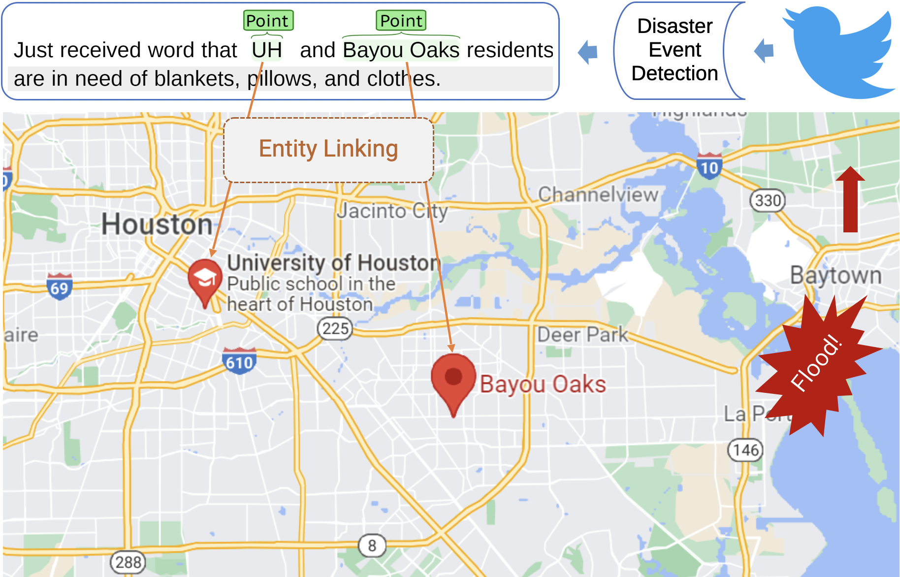

# HarveyNER
We introduce a new dataset HarveyNER with **fine-grained locations** annotated in tweets. This dataset presents unique challenges and characterizes many complex and long location mentions in informal descriptions. We built strong baseline models using **Curriculum Learning** and experimented with different heuristic curricula to better recognize diffcult location mentions. 

HarveyNER focuses on the coordinate-oriented locations so we mainly annotate Point that can be precisely pinned to a map and Area that occupies a small polygon of a map. Considering that some disasters can affect line-like objects (e.g., a food can affect the neighbors of a whole river), we also include Road and River types.
* Points: denote an exact location that a geocoordinate can be assigned. E.g., a uniquely named building, intersections of roads or rivers.
* Areas: denote geographical entities such as city subdivisions, neighborhoods, etc.
* Roads: denote a road or a section of a road.
* Rivers: denote a river or a section of a river.

# Statistics of HarveyNER
|    Data Split    | Train | Valid |  Test | Total |
|:----------------:|:-----:|:-----:|:-----:|:-----:|
|    All Tweets    | 3,967 | 1,301 | 1,303 | 6,571 |
|  Tweet w/ Entity | 1,087 |  366  |  353  | 1,806 |
| Tweet w/o Entity | 2,880 |  935  |  950  | 4,765 |
|  All Entity Type | 1,581 |  523  |  500  | 2,604 |
|       Point      |  591  |  206  |  202  |  999  |
|       Area       |  715  |  236  |  212  | 1,163 |
|       Road       |  158  |   51  |   57  |  266  |
|       River      |  117  |   30  |   29  |  176  |

# Dataset
Please use the latest version in the [data](https://github.com/brickee/HarveyNER/tree/main/data/tweets) directory

# Requirement
Please see [requirement](https://github.com/brickee/HarveyNER/blob/main/requirements.txt)
<!-- ```sh
$ pytorch-transformers==1.2.0
$ torch==1.7.1
$ # metric
$ seqeval==1.2.1
$ # training progressbar
$ tqdm==4.31.1
$ # tokeniztion
$ nltk==3.4.5
$ # for rest api
$ Flask==1.1.1
$ Flask-Cors==3.0.8
``` -->

# Run 
```sh
$ python run_ner_loc.py --data_dir=data/tweets --bert_model=bert-base-uncased --task_name=ner --max_seq_length=48 --num_train_epochs=50 --learning_rate=5e-5 --bert_lr=5e-5 --train_batch_size=32 --eval_batch_size=32 --do_train --do_eval --do_predict --seed=42  --do_lower_case --warmup_proportion=0.1 --curriculum=commonness --netural --complexity_lambda=0.6 --maximum_lambda=1 --anti

```

# Citation
If you extend or use this dataset, please cite the [paper](https://aclanthology.org/2022.naacl-main.243/) where it was introduced.
```sh
@inproceedings{chen-etal-2022-crossroads,
    title = "Crossroads, Buildings and Neighborhoods: A Dataset for Fine-grained Location Recognition",
    author = "Chen, Pei  and Xu, Haotian  and Zhang, Cheng  and Huang, Ruihong",
    booktitle = "NAACL",
    year = "2022",
    publisher = "Association for Computational Linguistics",
    url = "https://aclanthology.org/2022.naacl-main.243",
}
```
